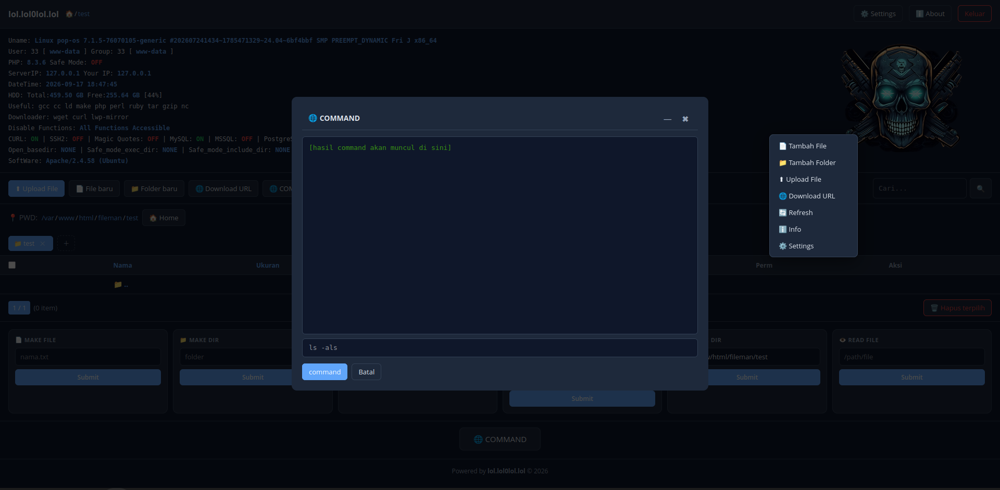
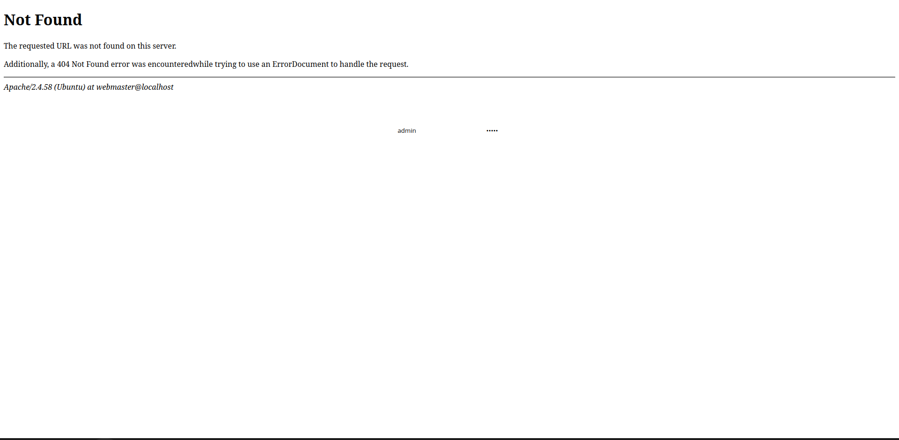
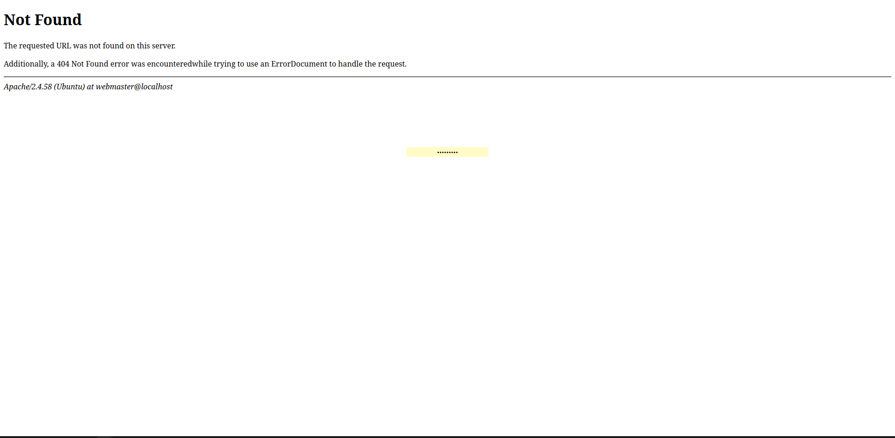

<!--
  Welcome to the GitHub profile of ZeroHitman.
  Crafted for clarity, edge, and hacker spirit.
-->

<h1 align="center">
  
</h1>

## 📦 About the Tool

**lol.lol0lol.lol** is a lightweight file manager with features similar to **Alfa Shell**, but with most of the dangerous capabilities stripped out — leaving only a safe, minimal file manager.

### 🔐 Login Modes

| Mode | Description |
|------|-------------|
| **v1 — Username + Password** | Sign in with a username and a password |
| **v2 — Password Only** | Sign in with a password only |

The login mode can be configured directly inside the file manager.

### 🔑 Default Credentials

| Field | Value |
|-------|-------|
| Username | `admin` |
| Password | `admin` |

> ⚠️ **Change the default credentials immediately after the first login.**

---

## 📸 Screenshot

### Home

### Login v1 — Username + Password

### Login v2 — Password Only

---

## ⚙️ How to Use

1. Upload the file manager to a PHP-enabled server.
2. Open it in your browser.
3. Set the login mode inside the file manager settings:
   - `userpass` → username + password
   - `password` → password only
4. Log in with the default credentials (`admin` / `admin`).
5. **Change the username and password right away.**

---

## ⚠️ Disclaimer

> This tool is provided for **educational purposes**, **security auditing**, and **personal file management** only.  
> The author is not responsible for any misuse. Use it only on systems you own or have explicit permission to access.

---

  Made with 🖤 by <a href="https://github.com/ZeroHitman">ZeroHitman</a>

